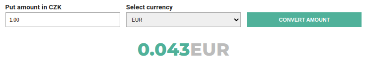

Momence demo app
================
Application fetches current exchange rates from the Czech National Bank and allows to convert 
Czech currency to rates listed.



### TechStack
>**Typescript**  
**Local Dev & Deploy** - Docker, multistage docker compose, Nginx  
**BE** - NestJS FW with Axios for http reqs  
**FE** - ReactApp, React Query, Styled-Components, MUI lib

### Running the app
in the root of the app
```bash
# build the app
$ docker compose -f docker-compose.prod.yml build
# run it
$ docker compose -f docker-compose.prod.yml up -d
```
Then visit http://localhost:3000
>see **.env** for number of port

### Local DEV
```bash
# possibly needs to install node_modules first
$ cd backend && npm i
$ docker compose build --no-cache
$ docker compose up
```
### My Comment
There is definitely things that need some more work like:
- test coverage
- exception handling  
- data validations
- on real project I would probably use some library to work with decimals, dates
and forms (eg.:Formik) 

I included the backend even though it wasn't part of the assignment, because I worked
on one project in the past, which was created in NestJS and I got really fond of it. Also,
my React skills lowered a bit, as I've been mostly doing backend and a bit of DevOps
in last two years. I tried on this project the pnpm manager, and it was painful experience,
especially when I tried my dockerized map on MAC. In the end I returned to old good npm.
Let me know if anything.

> App tested on PC (Ubuntu) with i7 and Mac with M1 
